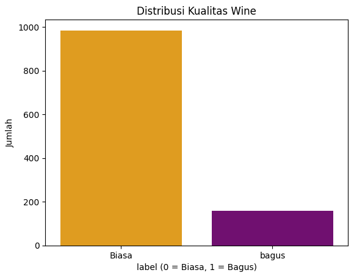
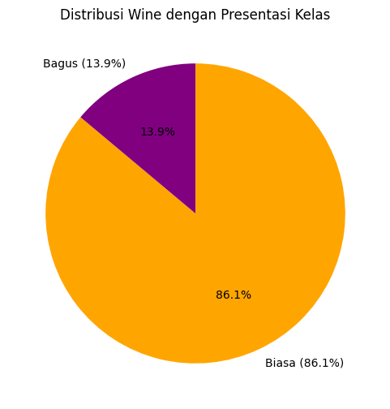
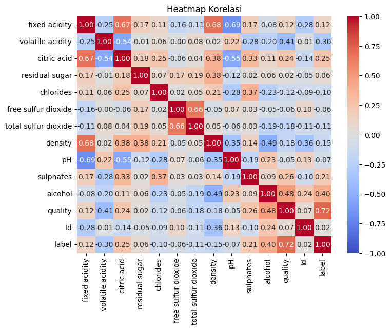
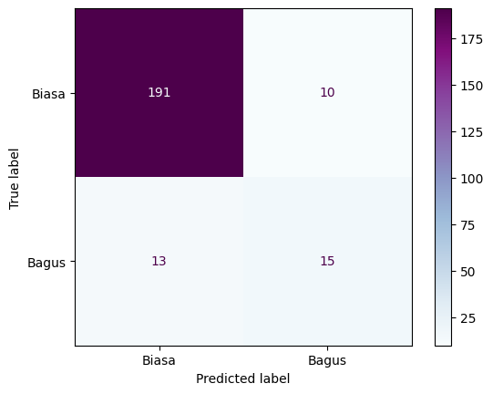

# Wine-Quality-Classifier-with-Decision-Tree-and-Random-Forest
Projek ini bertujuan untuk melihat perbedaan akurasi penggunaan decision tree dan random forest

# Memahami masalah
Wine adalah adalah minuman yang dibuat dari fermentasi buah anggur dengan kadar alcohol sekitar 12-15%. Permasalahan yang diungkit dalam studi ini adalah bagaimana memprediksi kualitas wine berdasarkan fitur fitur kimiawi yang terdapat dalam dataset. Fitur quality atau kualitas wine awalnya merupakan data numerik dari skala 0 hingga 10. Namun, untuk mempermudah proses klasifikasi, nilai kualitas ini dikategorikan menjadi dua kelas, yaitu kelas 1 untuk wine berkualitas bagus atau baik dengan nilai kualitas lebih dari sama dengan 7, dan kelas 0 untuk wine dengan kualitas dibawah itu atau biasa saja. Tujuan dari studi ini adalah untuk membanun
model klasifikasi yang dapat memprediksi kualitas wine, berdasarkan atribut kimia yang dimilikinya, seperti kadar alcohol, keasaman, dan pH. Dengan adanya model ini, pihak-pihak seperti produsen wine, quality control, maupun penjual biasa memperoleh gambaran awal mengenai kualitas produk tanpa harus langsung melalui uji rasa atau secara manual yang membutuhkan waktu dan biaya.

# Pengumpulan data
Dalam studi ini menggunakan dataset wine quality dataset yang tersedia di platform Kaggle. Dataset ini terdiri dari 12 variabel yang semuanya bertipe numerik yaitu fixed acidity, volatile acidity, citriacid, residualsugar, chlorides, free sulfurdioxide, total sulfurdioxide, density, pH, sulphates, alcohol, quality. Selanjutnya dataset diimport menggunakan fungsi pd.read_csv(). Kemudian untuk melihat struktur data menggunakan df.info(), statistika deskriptif menggunakan df.describe(), dan mendeteksi apakah ada nilai kosong menggunakan fungsi df.isnull.sum(). (Zheng, Z., Jin, L., et al. 2020)

# Persiapan Data
Selanjutnya dilakukan persiapan data dengan membersihkan data dari outlier menggunakan metode IQR. Nilai-nilai yang jauh dari rentang normal dihilangkan agar tidak memengaruhi kinerja model nantinya. Kemudian juga dilakukan pelabelan ulang terhadap variable quality menjadi biner yaitu 0
dan 1 dengan fungsi apply(lambda x: 1 if x >= 7 else 0) karena tipe data pada variabel quality sudah numerik dan juga dilakukan proses pemisahan antara fitur dan target

# Visualisasi data
Selain membersihkan data diperlukan juga eksplorasi data menggunakan visualisasi untuk melihat keseimbangan antar kelas digunakan sns.counplot():

Pada tahap ini, distribusi dari label target taitu kualitas wine yang telah diklasifikasikan menjadi dua kategori 0 untuk kualitas biasa dan 1 untuk kualitas bagus. Grafik batang pada gambar diatas menunjukkan bahwa jumlah wine dengan kualitas biasa yang berlabel 0 jauh lebih banyak dibandingkan dengan wine kualitas bagus yang berlabel 1, Tepatnya sekitar 980 berkualitas biasa dan yang berkualitas bagus hanya sekitar 160. Selain grafik batang, juga dibuat visualisasi pie chart untuk menampilkan presentase proporsi kelas:

Berdasarkan pie chart diatas, dapat terlihat bahwa sebanyak 86,1% wine termasuk kategori biasa, sedangkan hanya 13,9% yang dikategorikan sebagai wine berkualitas bagus. Selain piechart, juga dilakuka korelasi antar variabel menggunakan heatmap korelasi:

Heatmap ini menunjukkan bahwa variabel alcohol memiliki korelasi positif yang cukup kuat terhadap variabel label (0,72) artinya semakin tinggi kadar alcohol, maka kemungkinan wine tergolong sebagai kualitas bagus juga meningkat. Variabel sulphates da citric acid juga menunjukkan korelasi positif meskipun lebih lemah. Sedangkan, variabel volatile acidity menunjukkan korekasi negative terhadap kualitas wine, berarti semakin tinggi nilai volatile acidity, maka kualitas wine cenderung lebih rendah.

# Pemodelan Data
Model yang digunakan adalah Regresi Logistik [2], yang cocok untuk klasifikasi biner. Tahap modeling diawali dengan memisahkan fitur dan target menggunakan x = df.drop(columns=’quality’) dan y = df[‘quality]. Data kemudian dibagi menjadi data latih dan data uji dengan perbandingan
80:20 menggunakan train_test_split(). Untuk memastikan skala fiturnya seragam dilakukan proses standarisasi dengan StandardScaler(). Kemudian dilatih menggunakan fungsi model.fit().

# Evaluasi Model
Setelah dilatih, kinerja model diuji pada data uji menggunakan fungsi predict(). Evaluasi dilakukan menggunakan classification_report, accuracy_score, dan roc_auc_score. Berdasarkan hasil evaluasi diperoleh:
1. Akurasi pada data pelatihan sebesar 0,8698 dan AUC sebesar 0,8895
2.  Akurasi pada data pengujian sebesar 0,8996 dan AUC sebesar 0,9012
3. Untuk kelas 0 (wine biasa) model memiliki precision sebesar 0.94, artinya dari semua prediksi wine biasa 94% benar. Recall sebesar 0.95 artinya dari seluruh wine biasa yang sebenarnya, 95% berhasil diprediksi dengan benar. F1-score sebesar 0.94 yang artinya rata rata dari precision dan recall, menunjukkan kinerja model seimbang untuk kelas ini.
4. Untuk kelas 1 (wine bagus) model memiliki precision sebesar 0.60 artinya dari semua prediksi wine bagus, hanya 60% yang benar. Recall 0.54 berarti dari seluruh wine bagus yang sebenarnya, hanya 54% yang berhasil diprediksi dengan benar. F1-score 0.57 berarti kinerja model dalam mengenali wine bagus masih rendah.
5. Akurasi keseluruhan 0.90 berarti model secara umum benar dalam memprediksi 90% data. Akurasinya cukup tinggi namun menurut Powers (2020), akurasi tidak selalu mencerminkan performa model secara keseluruhan, terutama jika data tidak seimbang. Oleh karena itu, metrik seperti precision, recall, dan F1-score digunakan sebagai alternatif yang lebih representative.
6. Macro avg didapatkan precision 0.77, recall 0.74 dan f1-score 0.75
7. Weighted avg didapatkan precision, recall, an f1-score semua 0.90
8. Pada confusion matrix dibawah ini menunjukkan bahwa model berhasil mengklasifikasikan 191 wine biasa dan 15 wine bagus secara benar. Namun, terdapat 10 prediksi salah untuk ke;as biasa dan 13 salah pada kelas bagus. Artinya, model, cukup baik mengenali wine biasa, tapi masih kurang akurat mengenali wine bagus, karena jumlah datanya lebih sedikit.

Berdasarkan hasil evaluasi model klasifikasi kualitas wine, didapatkan akurasi yang cukup tinggi sekitar 0.90 atau 90% dan nilai AUC data uji sebesar 0.90, yang menunjukkan bahwa model cukup baik dalam mengelompokkan wine berkualitas bagus dan biasa. Namun, nilai precision dan recall untuk kelas wine berkualitas bagus masih lebih rendah dibanding kelas biasa, berarti ada ketidakseimbangan data yang mempengaruhi kinerja model.
